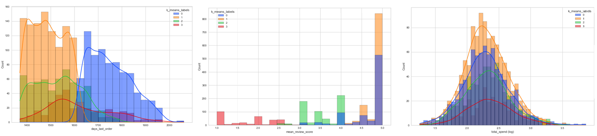
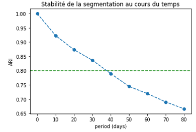

# 🛍️ CustomerInsights

 <!-- Placeholder image for context -->

## 🏢 **Project Overview**

This project aims to provide a **robust customer segmentation model** for the marketing team of an online marketplace. The segmentation model enables targeted communication by identifying distinct customer groups based on purchasing behavior and satisfaction, ultimately improving marketing efficiency and customer retention.

## 🎯 **Objectives**

- **Primary Goal**: Segment customers to identify actionable customer groups for targeted marketing.
- **Secondary Goal**: Determine the optimal frequency of model maintenance by analyzing segment stability over time.

## 📊 **Data Sources**

- **Main Dataset**: [data](https://www.kaggle.com/datasets/olistbr/brazilian-ecommerce)
- **Key Variables**: `total_spend`, `days_last_order`, `nb_orders`, `mean_review_score`

## **Project Structure**

This project is organized into several main steps:

1. **Exploratory Data Analysis (EDA)**: Initial data exploration, feature engineering, and cleaning to prepare the dataset for modeling.
2. **Clustering & Segmentation**: Implementation of the K-Means clustering algorithm and selection of an optimal number of clusters using multiple metrics.
3. **Stability Analysis**: Analysis of model stability over time to recommend a frequency for re-segmentation.

## 🔬 **Methodology**

1. **Data Preparation**
   - Load data and clean any inconsistencies or missing values.
   - Perform feature engineering 

2. **Modeling**
   - **K-Means Clustering**: Apply K-Means to create clusters based on customer behavior.
   - **Cluster Analysis**: Evaluate clusters to identify key customer segments based on characteristics like total spend, last order date, and satisfaction.

3. **Stability Analysis**
   - Measure the model’s stability over time using the Adjusted Rand Index (ARI) to determine when the segmentation should be refreshed.

## ✅ **Results**

### Identified Segments
The clustering process identified four primary customer segments:

- **Label 0 (bleue)**: Satisfied but inactive customers, showing low engagement despite good satisfaction scores.
- **Label 1 (orange)**: Highly engaged and satisfied customers, who interact with the platform frequently.
- **Label 2 (green)**: Regular but moderately engaged customers, generally content but less active.
- **Label 3 (red)**: Least satisfied customers, typically with lower review scores and infrequent purchases.

  
  
> **Note on Spending Patterns**: Interestingly, total spending did not significantly vary across clusters. This could be due to the short data collection period, where most customers have only made one or two purchases, limiting variability in spending. Additionally, other behavioral aspects (like frequency and satisfaction) seem to be stronger differentiators for segmentation in this context.

### Stability Analysis

- **Model Maintenance**: Based on ARI scores, re-segmentation every 30 days is recommended to ensure accurate and actionable segmentation results.

  

## 🚀 **Potential Improvements**

- **Refinement of Features**: Further exploration of behavioral or demographic features could refine segmentation.
- **Model Optimization**: Consider other clustering methods (e.g., hierarchical clustering) to see if they yield more stable or interpretable segments.

## 📫 **Contact**

**Alexis Marceau**  
📧 [alexis.marceau.12@gmail.com](mailto:alexis.marceau.12@gmail.com)  
🔗 [LinkedIn](https://www.linkedin.com/in/alexis-marceau/?locale=en_US)
